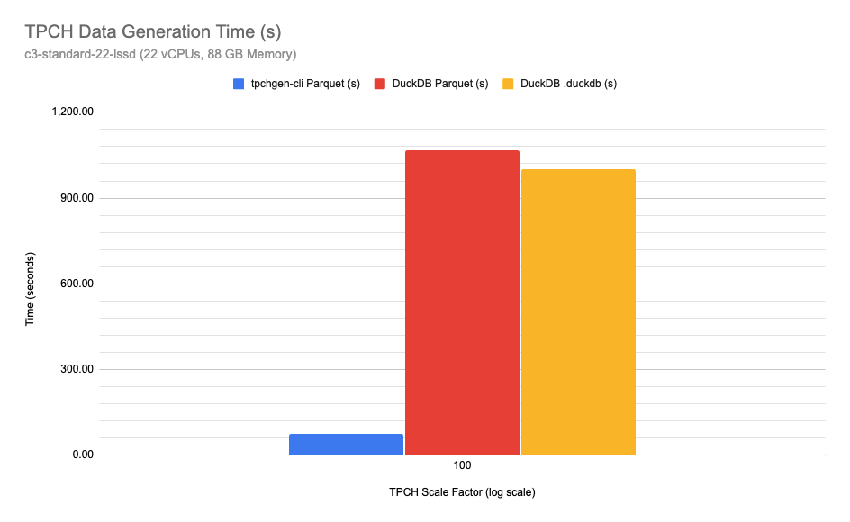

# tpcgen-rs: Quickly and Easily Create TPC-* Benchmark Data

> [!NOTE]
> Made with ❤️ by [@clflushopt], [@alamb] and [@kevinjqliu]
> 
> Originally located at [`clflushopt/tpchgen-rs`], the project is now maintained at
> [`datafusion-contrib/tpcgen-rs`]

[@clflushopt]: https://github.com/clflushopt
[@alamb]: https://github.com/alamb
[@kevinjqliu]: https://github.com/kevinjqliu
[`clflushopt/tpchgen-rs`]: https://github.com/clflushopt/tpchgen-rs
[`datafusion-contrib/tpcgen-rs`]: https://github.com/datafusion-contrib/tpcgen-rs

[![Apache licensed][license-badge]][license-url]
[![Build Status][actions-badge]][actions-url]

[license-badge]: https://img.shields.io/badge/license-Apache%20v2-blue.svg
[license-url]: https://github.com/datafusion-contrib/tpcgen-rs/blob/main/LICENSE
[actions-badge]: https://github.com/datafusion-contrib/tpcgen-rs/actions/workflows/rust.yml/badge.svg
[actions-url]: https://github.com/datafusion-contrib/tpcgen-rs/actions?query=branch%3Amain

Modern, blazing fast and easy to use [TPC-H] and [TPC-DS] benchmark data generators.

[TPC-H]: https://www.tpc.org/tpch/
[TPC-DS]: https://www.tpc.org/tpcds/

## Goal

Democratize the comparison of analytical systems with tools for easily and
efficiently generating benchmark data for common benchmarks in modern formats
such as [Apache Parquet], [Apache Arrow], and CSV.

[Apache Parquet]: https://parquet.apache.org/
[Apache Arrow]: https://arrow.apache.org/

## Features

1. Blazing Speed 🚀 
2. Easy to Use: CLI or embeddable libraries
3. Obsessively Tested 📋
4. Resource Efficient: multi-core and constant memory use 🧠

## Sub projects

| Project                            | Description                                                               |
| ---------------------------------- | ------------------------------------------------------------------------- |
| [`tpcgen-cli`](tpcgen-cli)         | Command line tool to generate TPC-H and TPC-DS data in multiple formats   |
| [`tpchgen-cli`](tpchgen-cli)       | Command line tool to generate TPC-H data in multiple formats              |
| [`tpchgen`](tpchgen)               | Rust library to generate TPC-H data (zero dependencies)                     |
| [`tpchgen-arrow`](tpchgen-arrow)   | Rust library to generate TPC-H data in [Apache Arrow] format              |
| [`tpcdsgen`](tpcdsgen)             | Rust library to generate TPC-DS data (zero dependencies)                    |
| [`tpcdsgen-arrow`](tpcdsgen-arrow) | Rust library to generate TPC-DS data in [Apache Arrow] format             |

## Representative Performance (10x Faster)

## Testing

We go through great lengths to ensure our data generators produce the same exact
bytes as the reference implementations, both for single and multi-part output.
Our multi-level strategy for ensuring correctness is detailed in
[TESTING.md](TESTING.md) and includes comparing the output of our generators to
the original reference implementations as part of CI.

## Contributing

Pull requests are welcome. For major changes, please open an issue first for
discussion. See our [contributors guide](CONTRIBUTING.md) for more details.

## Architecture

Please see [architecture guide](ARCHITECTURE.md) for details on how the code
is structured.

## License

The project is licensed under the [APACHE 2.0](LICENSE) license.
